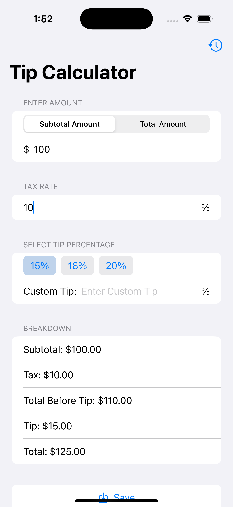

# Tip Calculator

A simple and elegant iOS tip calculator that helps you calculate tips easily.

## Features

- Calculate tips based on subtotal or total amount
- Flexible tax rate input
- Quick tip presets (15%, 18%, 20%)
- Custom tip percentage option
- Detailed breakdown showing:
  - Subtotal
  - Tax amount
  - Total before tip
  - Tip amount
  - Final total

## How to Use

1. Choose calculation mode:
   - Subtotal Amount: Enter the amount before tax
   - Total Amount: Enter the amount including tax

2. Enter the tax rate percentage

3. Select tip percentage:
   - Use preset buttons (15%, 18%, 20%)
   - Or enter a custom tip percentage

4. View the detailed breakdown of all calculations
